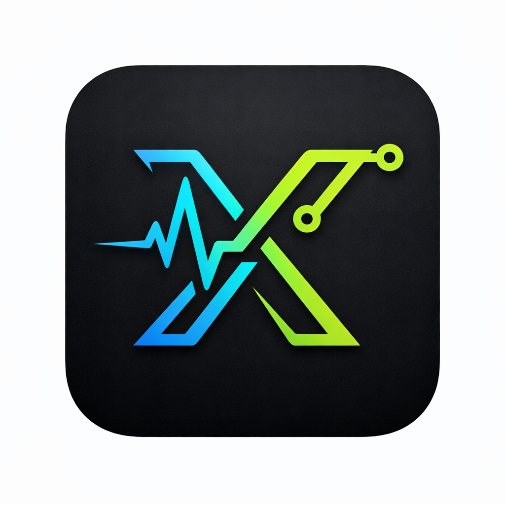

🧬 X-Phage (.xp0)

  

  <b>The Next-Generation Secure Systems Programming Language</b> 
  Built for Performance. Designed for Control. Engineered for Stealth.

  
  
  
   
  
  
  
   
  
  

## 🛰 Overview

X-Phage is a lightweight, hardware-aware programming language designed for secure systems, next-generation OS development, and controlled execution environments.

It combines:

Low-level precision

Minimal syntax overhead

Secure memory abstraction

High-performance compilation

X-Phage introduces original execution concepts such as Ghost Memory Allocation and Pulse Core Logic, enabling developers to build secure and efficient system components with clarity and control.

---

## ⚡ Core Philosophy

X-Phage is built on three principles:

1. Controlled Memory Exposure

2. Minimal Execution Surface

3. Predictable Runtime Behavior

No unnecessary abstraction layers.
No bloated runtime overhead.
Pure deterministic execution.

---

## 🔥 Key Features

🧠 Ghost Memory (shadow)

Temporary, secure memory scope for sensitive data handling.

shadow auth_token = "X-9982-PHAGE"

---

💓 Pulse Execution Model

Centralized execution entry using pulse core for structured and efficient runtime flow.

pulse core {
    beam "System Initialized"
}

---

🔗 Aeon Linking

Modular library linking using the ~link directive.

~link "aeon.core"

---

## 🚀 Lightweight Compiler

Written in C++17

Fast compilation

Minimal binary footprint

Optimized for Termux & Linux

---

## 🗂 Project Structure

X-Phage/
├── bin/        # Compiled binaries
├── docs/       # Documentation & Manual
├── lib/        # Standard Libraries (.xh)
├── src/        # Compiler Core Source (.cpp)
├── tests/      # Language Test Suites (.xp0)
└── build.sh    # Automated Build Script

---

## 🛠 Installation & Build

📌 Prerequisites

Clang++

Make

Termux:

pkg install clang
pkg install make

---

⚙ Quick Build

git clone https://github.com/AeonCoreX-Lab/X-Phage.git
cd X-Phage
bash build.sh

---

## ⌨️ Syntax Showcase

Secure handshake example:

~link "aeon.core"

pulse core {
    shadow auth_token = "X-9982-PHAGE"
    atom status = "1"

    beam "--- Initializing System ---"
    
    scan status {
        beam "Access Granted."
        beam auth_token
    }
}

---

## 🧪 Use Cases

Secure OS Components

Embedded Runtime Systems

Controlled Automation Environments

Lightweight Compiler Research

Cyber-Security Focused Development

---

## 🤝 Contributing

We welcome structured contributions to:

Compiler Core

Standard Libraries

Documentation

Syntax Highlighting Plugins

Contribution Flow

git checkout -b feature/your-feature
git commit -m "Add new feature"
git push origin feature/your-feature

Then open a Pull Request.

---

## ⚖️ License & Intellectual Property
This project is licensed under the **GNU AGPLv3**.  
Under this license, any derivative works or services using X-Phage must remain open-source and contribute back to the original repository.

---

## 📞 Maintainer

AeonCoreX Lab
Project Status: Active Development (v1.3)

---

## 🧬 X-Phage

Engineered for the future of secure execution.

***Copyright © 2026 **AeonCoreX**. All rights reserved.***
---